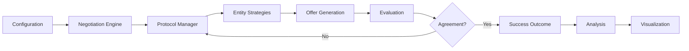

# AI Agent Negotiation Simulator - Complete Documentation

## Table of Contents

1. [Overview](#overview)
2. [Architecture](#architecture)
3. [Core Concepts](#core-concepts)
4. [Installation](#installation)
5. [Usage Guide](#usage-guide)
6. [API Reference](#api-reference)
7. [Advanced Features](#advanced-features)
8. [Configuration](#configuration)
9. [Strategies](#strategies)
10. [Analysis Tools](#analysis-tools)
11. [Troubleshooting](#troubleshooting)
12. [Contributing](#contributing)

---

## Overview

The AI Agent Negotiation Simulator is a sophisticated framework for modeling and analyzing multi-party negotiations. It combines game theory, machine learning, and behavioral modeling to simulate realistic negotiation dynamics.

### Key Features

- **Multi-party negotiations** with 2-10 entities
- **Multiple negotiation protocols** (alternating, simultaneous, random)
- **Game theory analysis** (Nash equilibrium, Pareto optimality, ZOPA)
- **Advanced strategies** including adaptive, MCTS, Q-learning
- **Comprehensive visualization** and analysis tools
- **LLM integration** for parameter tuning (V2)
- **Web interface** for easy interaction
- **Batch simulation** capabilities

### Use Cases

- International relations and diplomacy
- Business negotiations and contracts
- Resource allocation and sharing
- Climate accords and environmental agreements
- Supply chain negotiations
- Labor negotiations
- Research in game theory and behavioral economics

---

## Architecture

### System Components

```
.
├── Core Engine
│   ├── models.py         # Data models and structures
│   ├── protocol.py       # Negotiation orchestration
│   └── utilities.py      # Game theory calculations
├── Intelligence Layer
│   ├── advisor.py        # AI advisory system
│   ├── advanced_strategies.py  # ML-based strategies
│   └── llm_integration.py     # LLM connectivity (V2)
├── Interfaces
│   ├── cli.py           # Command-line interface
│   ├── web_interface.py # Streamlit web UI
│   └── api.py          # REST API (optional)
├── Analysis
│   ├── visualization.py # Charts and graphs
│   └── reporting.py    # Report generation
└── Infrastructure
    ├── Dockerfile      # Container configuration
    └── docker-compose.yml # Service orchestration
```

### Data Flow



---

## Core Concepts

### Entities

Entities are the negotiating parties (countries, companies, individuals) with:
- **Utility Functions**: How they value different outcomes
- **Policies**: Their negotiation strategy
- **Constraints**: Minimum acceptable terms

### Issues

Issues are the negotiable items with:
- **Range**: Minimum and maximum values
- **Divisibility**: Continuous or discrete
- **Units**: Measurement units

### Utility Functions

Mathematical representation of preferences:
```python
utility = Σ(weight_i × normalized_value_i)
```

Where normalized value = (actual - reservation) / (ideal - reservation)

### Policies

Negotiation strategies that determine:
- When to accept offers
- How to make counter-offers
- Concession patterns

### Protocols

Rules governing the negotiation process:
- **Alternating**: Parties take turns
- **Simultaneous**: All propose at once
- **Random**: Random selection each round

---

## Installation

### Prerequisites

- Python 3.9+
- pip or conda
- Git

### Basic Installation

```bash
# Clone repository
git clone https://github.com/yourusername/negotiation-simulator.git
cd negotiation-simulator

# Create virtual environment
python -m venv venv
source venv/bin/activate  # On Windows: venv\Scripts\activate

# Install dependencies
pip install -r requirements.txt

# Install package
pip install -e .
```

### Docker Installation

```bash
# Build image
docker build -t negotiation-sim .

# Run container
docker run -it negotiation-sim

# Or use docker-compose for full stack
docker-compose up
```

### Development Installation

```bash
# Install with dev dependencies
pip install -e ".[dev]"

# Install pre-commit hooks
pre-commit install

# Run tests
pytest tests/ -v --cov
```

---

## Usage Guide

### Command Line Interface

#### Basic Commands

```bash
# Run single negotiation
python cli.py run config.yaml

# Run with visualization
python cli.py run config.yaml --viz

# Batch simulations
python cli.py batch config.yaml --n-runs 100

# Analyze negotiation space
python cli.py analyze config.yaml --samples 1000

# Generate examples
python cli.py example
```

#### Configuration File Format

```yaml
entities:
  - name: "Entity1"
    type: "company"
    utility:
      weights: {price: 0.7, quantity: 0.3}
      ideal_values: {price: 100, quantity: 1000}
      reservation_values: {price: 200, quantity: 500}
    policy:
      type: "linear_concession"
      params:
        accept_threshold: 0.7
        concession_rate: 0.1

issues:
  - name: "price"
    min_value: 50
    max_value: 300
    unit: "USD"

max_rounds: 100
protocol: "alternating"
```

### Web Interface

```bash
# Start web interface
streamlit run web_interface.py

# Access at http://localhost:8501
```

Features:
- Visual configuration builder
- Real-time simulation
- Interactive visualizations
- Batch analysis
- Report generation

### Python API

```python
from models import Entity, Issue, SimulationConfig
from protocol import NegotiationEngine

# Create entities
buyer = Entity(name="Buyer", ...)
seller = Entity(name="Seller", ...)

# Define issues
issues = [Issue(name="price", min_value=100, max_value=500)]

# Configure simulation
config = SimulationConfig(
    entities=[buyer, seller],
    issues=issues,
    max_rounds=50
)

# Run negotiation
engine = NegotiationEngine(config)
outcome = engine.run()

print(outcome.summary())
```

---

## API Reference

### Core Classes

#### Entity

```python
class Entity:
    name: str
    type: Literal["country", "company", "individual"]
    utility_function: UtilityFunction
    policy: NegotiationPolicy
    max_rounds: int = 100
    min_acceptable_utility: float = 0.5
```

#### Issue

```python
class Issue:
    name: str
    min_value: float
    max_value: float
    divisible: bool = True
    unit: Optional[str] = None
```

#### NegotiationPolicy

```python
class NegotiationPolicy:
    type: PolicyType
    params: PolicyParameters

    def make_offer(round_num, history, utility_fn, issues) -> Dict
    def evaluate_offer(offer) -> Tuple[bool, float]
```

#### NegotiationOutcome

```python
class NegotiationOutcome:
    success: bool
    final_agreement: Optional[Dict[str, float]]
    rounds_taken: int
    final_utilities: Dict[str, float]
    transcript: List[NegotiationRound]
    impasse_reason: Optional[str]
```

### Utility Functions

```python
# Calculate joint utility
calculate_joint_utility(offer, entities) -> float

# Find Nash bargaining solution
find_nash_bargaining_solution(entities, issues) -> Dict

# Check Pareto optimality
is_pareto_optimal(offer, entities, issues) -> bool

# Find ZOPA
find_zopa(entities, issues, samples) -> List[Dict]
```

---

## Advanced Features

### Machine Learning Strategies

#### Adaptive Strategy
Learns from opponent behavior and adjusts tactics:
```python
strategy = AdaptiveStrategy()
strategy.learning_rate = 0.1
strategy.exploration_rate = 0.2
```

#### Monte Carlo Tree Search
Simulates future paths to find optimal moves:
```python
strategy = MonteCarloTreeSearchStrategy(simulations=100)
```

#### Q-Learning Strategy
Reinforcement learning approach:
```python
strategy = ReinforcementLearningStrategy(
    alpha=0.1,  # Learning rate
    gamma=0.9,  # Discount factor
    epsilon=0.1  # Exploration rate
)
```

### Batch Analysis

```python
runner = BatchNegotiationRunner(config)

# Run with parameter variations
results = runner.run_batch(
    n_runs=100,
    vary_params={
        'entities[0].policy.params.concession_rate': (0.05, 0.15)
    }
)

analysis = runner.analyze_results()
```

### Advisory System

```python
advisor = NegotiationAdvisor()
report = advisor.analyze_outcome(config, outcome)

# Get recommendations
for suggestion in report.parameter_suggestions:
    print(f"{suggestion.parameter_path}: {suggestion.current_value} -> {suggestion.suggested_value}")
    print(f"Rationale: {suggestion.rationale}")
```

---

## Configuration

### Environment Variables

```bash
# Set in .env file
NEGOTIATION_MAX_ROUNDS=100
NEGOTIATION_DEFAULT_PROTOCOL=alternating
NEGOTIATION_LOG_LEVEL=INFO
NEGOTIATION_OUTPUT_DIR=./outputs
```

### Logging Configuration

```python
import logging

logging.basicConfig(
    level=logging.INFO,
    format='%(asctime)s - %(name)s - %(levelname)s - %(message)s',
    handlers=[
        logging.FileHandler('negotiation.log'),
        logging.StreamHandler()
    ]
)
```

### Performance Tuning

```python
# Optimize for large simulations
config.track_pareto = False  # Disable expensive calculations
config.calculate_nash = False
config.max_rounds = 50  # Reduce max rounds

# Parallel processing
from multiprocessing import Pool

with Pool() as pool:
    results = pool.map(run_simulation, configs)
```

---

## Strategies

### Basic Strategies

#### Linear Concession
- Gradual, predictable concession
- Good for building trust
- Parameters: concession_rate

#### Tit-for-Tat
- Mirrors opponent's concessions
- Encourages reciprocity
- Parameters: stubbornness

#### Boulware
- Hard early, concedes late
- Maximizes early advantage
- Parameters: patience

#### Conceder
- Concedes early, hard late
- Signals cooperation
- Parameters: initial_demand

### Advanced Strategies

#### Mixed Strategy
Probabilistically switches between strategies:
```python
strategy = MixedStrategy(
    strategy_weights={
        PolicyType.LINEAR_CONCESSION: 0.4,
        PolicyType.TIT_FOR_TAT: 0.3,
        PolicyType.BOULWARE: 0.3
    }
)
```

#### Adaptive Learning
Updates based on opponent patterns:
```python
strategy = AdaptiveStrategy()
# Automatically adjusts concession rate based on opponent behavior
```

### Strategy Selection Guide

| Scenario | Recommended Strategy | Reasoning |
|----------|---------------------|-----------|
| Unknown opponent | Mixed/Adaptive | Flexibility and learning |
| Cooperative setting | Linear Concession | Predictable, fair |
| Competitive setting | Boulware | Maximize value extraction |
| Multi-party | Adaptive | Handle complexity |
| Time pressure | Conceder | Quick agreement |

---

## Analysis Tools

### Game Theory Metrics

#### ZOPA (Zone of Possible Agreement)
```python
zopa = find_zopa(entities, issues)
if not zopa:
    print("No possible agreement exists")
```

#### Nash Bargaining Solution
```python
nash_solution = find_nash_bargaining_solution(entities, issues)
nash_product = calculate_nash_product(nash_solution, entities)
```

#### Pareto Optimality
```python
if is_pareto_optimal(outcome.final_agreement, entities, issues):
    print("Outcome is Pareto optimal")
```

### Visualization

#### Utility Progression
```python
plot_utility_progression(outcome)
```

#### Pareto Frontier
```python
plot_pareto_frontier(entities, issues, highlight_outcome=outcome)
```

#### Batch Analysis
```python
plot_batch_success_analysis(results)
```

### Reporting

Generate comprehensive reports:
```python
from visualization import generate_negotiation_report

generate_negotiation_report(
    outcome=outcome,
    config=config,
    output_dir=Path("./reports")
)
```

---

## Troubleshooting

### Common Issues

#### No ZOPA Found
**Problem**: Entities' reservation values are incompatible.
**Solution**: Adjust reservation values or ideal values to create overlap.

#### Constant Impasses
**Problem**: Entities too rigid.
**Solution**:
- Lower accept_threshold
- Increase concession_rate
- Use more flexible strategies

#### Deadlock Detection
**Problem**: Same offers repeated.
**Solution**:
- Add randomness to strategies
- Reduce stubbornness
- Switch to adaptive strategies

### Performance Issues

#### Slow Simulations
- Reduce max_rounds
- Disable pareto/nash calculations
- Use simpler strategies
- Enable parallel processing

#### Memory Issues
- Limit transcript storage
- Use generators for batch processing
- Clear session state periodically

### Debugging

Enable debug logging:
```python
import logging
logging.getLogger('negotiation').setLevel(logging.DEBUG)
```

Inspect negotiation state:
```python
# During negotiation
print(f"Round {engine.current_round}")
print(f"Current offers: {engine.history[-1].offers}")
print(f"Deadlocked: {engine._is_deadlocked()}")
```

---

## Contributing

### Development Setup

```bash
# Fork and clone
git clone https://github.com/yourusername/negotiation-simulator.git
cd negotiation-simulator

# Create branch
git checkout -b feature/your-feature

# Install dev dependencies
pip install -e ".[dev]"

# Run tests
pytest tests/ -v --cov

# Format code
black .
isort .
flake8 .
```

### Adding New Strategies

1. Create strategy class in `advanced_strategies.py`
2. Inherit from `NegotiationPolicy`
3. Implement `make_offer` method
4. Add tests in `tests/test_strategies.py`
5. Update documentation

Example:
```python
class MyStrategy(NegotiationPolicy):
    def make_offer(self, round_num, history, utility_fn, issues):
        # Your strategy logic
        return offer
```

### Testing

```bash
# Run all tests
pytest

# Run specific test
pytest tests/test_protocol.py::TestProtocol::test_alternating_protocol

# With coverage
pytest --cov=. --cov-report=html

# Performance tests
pytest tests/test_performance.py -v
```

### Documentation

- Use Google-style docstrings
- Update README for user-facing changes
- Add examples to documentation
- Include type hints

### Pull Request Process

1. Ensure tests pass
2. Update documentation
3. Add entry to CHANGELOG
4. Request review
5. Squash commits before merge

---

## License

MIT License - See LICENSE file for details.

## Citation

If you use this simulator in research, please cite:

```bibtex
@software{negotiation_simulator,
  title = {AI Agent Negotiation Simulator},
  author = {Your Name},
  year = {2024},
  url = {https://github.com/yourusername/negotiation-simulator}
}
```

## Support

- GitHub Issues: [Report bugs](https://github.com/yourusername/negotiation-simulator/issues)
- Discussions: [Ask questions](https://github.com/yourusername/negotiation-simulator/discussions)
- Email: support@negotiation-sim.ai

---

*Built with 🤝 for advancing negotiation research and practice*
